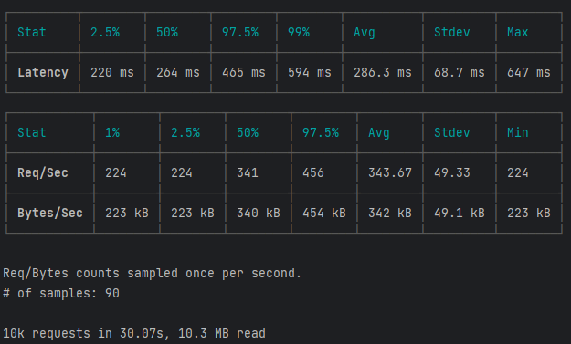
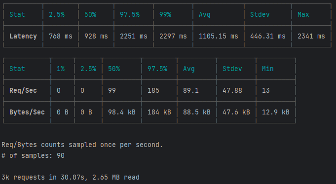

# Benchmark

command:
```
autocannon "http://localhost:3000/api/v1/currency-pair?pairs=ETH%2FGBP&pairs=XBT%2FCHF&pairs=ETH%2FJPY&pairs=BCH%2FGBP&pairs=ETH%2FCAD&pairs=XBT%2FUSD&pairs=BCH%2FEUR&pairs=ETH%2FUSD&pairs=BCH%2FAUD&pairs=XBT%2FGBP&pairs=ETH%2FEUR&pairs=ETH%2FAUD&pairs=XBT%2FCAD&pairs=BCH%2FUSD&pairs=XBT%2FJPY&pairs=XBT%2FEUR&pairs=XBT%2FAUD&pairs=BCH%2FJPY&pairs=ETH%2FCHF" -d 30 -c 100 -w 3
```

## Results

### Redis



### PostgreSQL


